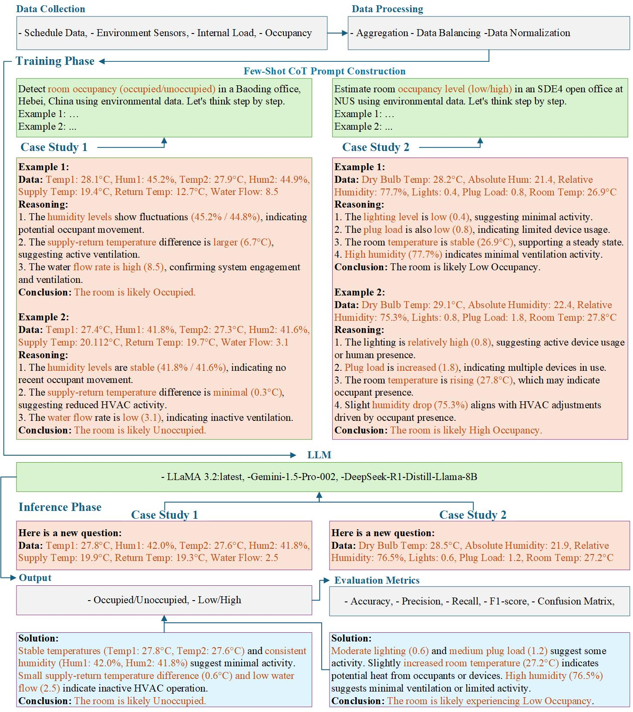

# Introduction

The repository contains the code implementation of the paper:

Exploring Large Language Models for Indoor Occupancy Detection and Estimation for Smart Buildings

<p align="center">  </p>

This study proposes an LLM-based occupancy detection and estimation framework using few-shot learning, chain-of-thought, and in-context learning, demonstrating that models like Gemini-Pro and DeepSeek-R1 outperform traditional methods across diverse datasets from China and Singapore, offering robust and adaptable solutions for smart building management.

If you find this project helpful, please give us a star ⭐ — your support is our greatest motivation.

## Table of Contents

- [Introduction](#introduction)
- [Installation](#installation)
- [Dataset Preparation](#dataset-preparation)
- [Model Training](#model-training)
- [Acknowledgements](#acknowledgements)
- [Citation](#citation)
- [Contact Us](#contact-us)


## Installation
### Dependencies
- Windows / Linux / macOS  
- Python 3.8+  
- Required Python packages: `pandas`, `numpy`, `scikit-learn`, `matplotlib`, `requests`  
- [Ollama](https://ollama.com/) (for local LLaMA 3.2 model inference)  
- API access for **DeepSeek-R1** and **Gemini-Pro**

### Environment Installation
We recommend using **Miniconda** to manage your Python environment.

**Step 0:** Install [Miniconda](https://docs.conda.io/en/latest/miniconda.html)

**Step 1:** Create and activate a virtual environment
```bash
conda create -n llm_occ python=3.8 -y
conda activate llm_occ
```
**Step 3:** Install dependencies

```bash
pip install pandas numpy scikit-learn matplotlib requests
```

### LLM Setup
**LLaMA 3.2 (Local via Ollama)**

Install [Ollama 3.2](https://ollama.com/) and pull the LLaMA model:

```bash
ollama pull llama3:8b
```

Run the model locally:

```bash
ollama run llama3
```
Our llm_models.py script connects to the local Ollama instance for LLaMA-based predictions.

**DeepSeek-R1 & Gemini-Pro (via API Keys)**

Obtain your API keys from the following sources:

- [DeepSeek API](https://platform.deepseek.com/)
- [Gemini API (Google AI Studio)](https://makersuite.google.com/)

Set your keys in a `.env` file or your environment:

```bash
# .env file format
DEEPSEEK_API_KEY=your_deepseek_key
GEMINI_API_KEY=your_gemini_key
```
### Clone the Repository
```bash
git clone https://github.com/kailaisun/LLM-occucpancy.git
cd LLM-occucpancy
```
## Dataset Preparation
This project uses two real-world datasets from an office building in China and an open-plan office in Singapore.


### 📄 Input Format

Each CSV file should contain:

- `datetime`: Timestamps in `YYYY-MM-DD HH:MM:SS` format  
- `occupant_num`: Ground-truth number of occupants (or binary label for Case Study 1)  
- Environmental features (e.g., temperature, humidity, plug load, airflow, FCU status, etc.)

---

###  Preprocessing Steps

Navigate to the `Code` directory and run:

```bash
# Step 1: Clean and parse raw data
python data_processing.py

# Step 2: Normalize features using Min-Max scaling
python normalization.py

# Step 3: Balance dataset (for binary classification case only)
python data_balancing.py

# Step 4: Split data by week, date, or interval (for model evaluation)
python Data_Splitting.py
```
## Model Training

Once your dataset is preprocessed, you can begin training traditional machine learning and large language models using the provided scripts in the `Code/` folder.

### Traditional ML Models

To train and evaluate baseline models (Logistic Regression, Random Forest, Decision Tree, XGBoost), run:

```bash
python Code/ML.py
```
### Large Language Models (LLMs)
To perform predictions using LLaMA 3.2 (via Ollama) and Gemini-Pro / DeepSeek-R1 (via API), run:

```bash
python Code/llm_models.py
```
Make sure you have:
LLaMA 3.2 running locally using Ollama 3.2

API keys for Gemini-Pro and DeepSeek-R1 configured via .env or environment variables

The script performs inference using few-shot prompting and outputs performance metrics for both binary occupancy detection and occupancy estimation.

## Acknowledgements
This repository is the code implementation of the paper  
[_Exploring Large Language Models for Indoor Occupancy Detection and Estimation for Smart Buildings_](https://github.com/kailaisun/LLM-occucpancy),  
based on real-world sensor datasets and few-shot prompting strategies.

## Citation
This paper is under review. The citation format is coming soon.

## Contact Us

If you have any further inquiries ❓, don't hesitate to get in touch with us 👨‍💻👩‍💻

